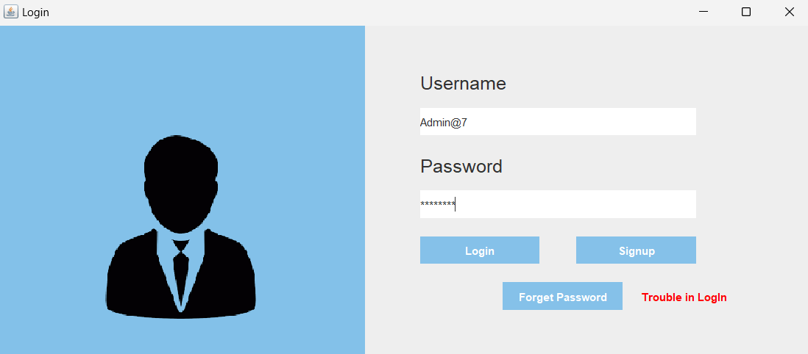

🧳 Travel Agency Management System – A Smart Solution for Modern Travel
The Travel Agency Management System is a Java-based desktop application designed to streamline and digitize the operations of a travel agency. It automates key tasks such as user registration, travel package management, booking, transport coordination, and administration, making it easier for travel agencies to provide efficient, personalized, and modern services to clients.

❓ Necessity of the Project
With the rapid growth of tourism and increasing expectations for personalized travel experiences, traditional, paper-based, or semi-digital agency workflows are no longer sufficient. This system was developed to solve several challenges:

Manual workload: Managing customers, bookings, and packages manually is time-consuming and error-prone.

Customer convenience: Users demand self-service tools like booking systems and real-time availability checks.

Data security and scalability: Sensitive customer and transaction data need secure, scalable handling.

Operational efficiency: Automation improves speed, accuracy, and consistency in services.

Thus, a unified platform that manages everything from user interaction to backend operations became a necessity.

💼 Applications & Advantages
✨ Applications
Small & medium travel agencies seeking digital transformation

Tour operators needing structured package management

Educational/training projects in software development

Custom agency management systems in niche tourism sectors (e.g., eco-tours, adventure travel)

✅ Advantages
📌 Centralized Management: Single platform for bookings, packages, hotels, transport, and users.

🕒 Time-Saving: Automates repetitive admin tasks like invoice generation and schedule tracking.

📈 Improved Accuracy: Reduces errors in booking and payment processes.

🧑‍💻 User-Friendly Interface: Built with Java Swing for an intuitive and accessible design.

🔐 Data Security: Uses JDBC with MySQL, ensuring secure and consistent data handling.

🛠️ Tech Stacks Used
Frontend
Java Swing / AWT: For building the GUI and layout components

NetBeans IDE: For developing, organizing, and debugging the application

Backend
JDBC (Java Database Connectivity): For connecting the app with the database

MySQL: To store users, packages, bookings, and other data

Other Tools
Git & GitHub: Version control and collaboration

XAMPP / MySQL Workbench: Local database server for testing

📌 Project Modules

1. 🧍 User Registration & Login
2. Features: Sign up, login, password encryption
Technologies: Java Swing, JDBC, MySQL

